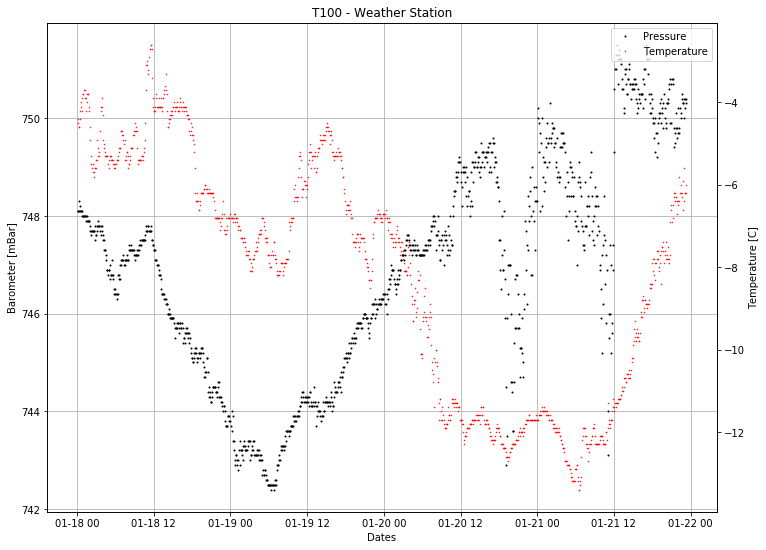
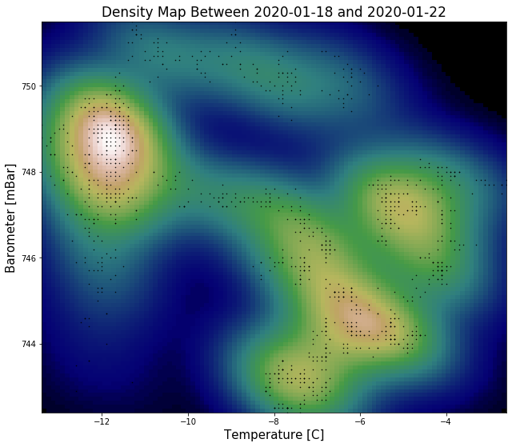

```python
%matplotlib inline
```

# ***tugmeteo***

### TÜBİTAK National Observatory (TUG) Meteorology Library

A library where instant and historical meteorological data can be obtained.

## Examples


```python
import matplotlib.pyplot as plt

from tugmeteo import TugMeteo
```

#### Basic operations


```python
met = TugMeteo()
```


```python
met.get_last_meteo('T100')
```


    {'timestamp': '2020-01-21T23:20:41',
     'telescope': 'T100',
     'TEMPERATURE': -6.0,
     'Inside Temperature': -4.2,
     'HUMIDITY': 32.0,
     'Inside Humidity': 59.0,
     'PRESSURE': 750.4,
     'WINDSPEED': 72.4,
     'WINDDIR': 61.0,
     'RAIN': 0.0,
     'UV': 0.0,
     'Solar Radiation': 0.0,
     'Wind Chill': -17.9,
     'Dew Point': -20.0,
     'High Temperature': -5.5,
     'Low Temperature': -13.4,
     'High Humidity': 89.0,
     'Low Humidity': 22.0,
     'High Barometer': 751.5,
     'Low Barometer': 743.1,
     'High Wind': 143.0,
     'Air Density': 0.978,
     'Est. Cumulus Base': 1751.0}


```python
met.get_temperature()
```


    {'timestamp': '2020-01-21T23:20:42',
     'info': 'Temperature',
     'unit': 'C',
     'RTT150': -6.4,
     'T100': -6.0,
     'T60': -6.6}


#### Getting meteo archive between '2020-01-18' and '2020-01-22' dates


```python
t = met.get_meteo_archives(telescope='T100', start_date='2020-01-18', end_date='2020-01-22')
```


```python
t
```


<div>
<style>
    .dataframe tbody tr th:only-of-type {
        vertical-align: middle;
    }

    .dataframe tbody tr th {
        vertical-align: top;
    }

    .dataframe thead th {
        text-align: right;
    }
</style>
<table border="1" class="dataframe">
  <thead>
    <tr style="text-align: right;">
      <th></th>
      <th>Timestamp</th>
      <th>Temp</th>
      <th>Chill</th>
      <th>HIndex</th>
      <th>Humid</th>
      <th>Dewpt</th>
      <th>Wind</th>
      <th>HiWind</th>
      <th>WindDir</th>
      <th>Rain</th>
      <th>Barom</th>
      <th>Solar</th>
      <th>ET</th>
      <th>UV</th>
    </tr>
  </thead>
  <tbody>
    <tr>
      <th>0</th>
      <td>2020-01-18 00:05:00</td>
      <td>-4.5</td>
      <td>-9.0</td>
      <td>-4.5</td>
      <td>78</td>
      <td>-7.7</td>
      <td>11</td>
      <td>16</td>
      <td>315</td>
      <td>0.0</td>
      <td>748.1</td>
      <td>0</td>
      <td>0.000</td>
      <td>0.0</td>
    </tr>
    <tr>
      <th>1</th>
      <td>2020-01-18 00:10:00</td>
      <td>-4.4</td>
      <td>-8.5</td>
      <td>-4.4</td>
      <td>78</td>
      <td>-7.7</td>
      <td>10</td>
      <td>13</td>
      <td>315</td>
      <td>0.0</td>
      <td>748.1</td>
      <td>0</td>
      <td>0.000</td>
      <td>0.0</td>
    </tr>
    <tr>
      <th>2</th>
      <td>2020-01-18 00:15:00</td>
      <td>-4.6</td>
      <td>-8.6</td>
      <td>-4.6</td>
      <td>79</td>
      <td>-7.6</td>
      <td>10</td>
      <td>13</td>
      <td>315</td>
      <td>0.0</td>
      <td>748.1</td>
      <td>0</td>
      <td>0.000</td>
      <td>0.0</td>
    </tr>
    <tr>
      <th>3</th>
      <td>2020-01-18 00:20:00</td>
      <td>-4.6</td>
      <td>-8.6</td>
      <td>-4.6</td>
      <td>80</td>
      <td>-7.5</td>
      <td>10</td>
      <td>13</td>
      <td>315</td>
      <td>0.0</td>
      <td>748.3</td>
      <td>0</td>
      <td>0.000</td>
      <td>0.0</td>
    </tr>
    <tr>
      <th>4</th>
      <td>2020-01-18 00:25:00</td>
      <td>-4.4</td>
      <td>-8.9</td>
      <td>-4.4</td>
      <td>79</td>
      <td>-7.5</td>
      <td>11</td>
      <td>13</td>
      <td>315</td>
      <td>0.0</td>
      <td>748.2</td>
      <td>0</td>
      <td>0.000</td>
      <td>0.0</td>
    </tr>
    <tr>
      <th>...</th>
      <td>...</td>
      <td>...</td>
      <td>...</td>
      <td>...</td>
      <td>...</td>
      <td>...</td>
      <td>...</td>
      <td>...</td>
      <td>...</td>
      <td>...</td>
      <td>...</td>
      <td>...</td>
      <td>...</td>
      <td>...</td>
    </tr>
    <tr>
      <th>1136</th>
      <td>2020-01-21 23:00:00</td>
      <td>-6.4</td>
      <td>-18.4</td>
      <td>-6.4</td>
      <td>31</td>
      <td>-20.7</td>
      <td>72</td>
      <td>82</td>
      <td>68</td>
      <td>0.0</td>
      <td>750.4</td>
      <td>0</td>
      <td>0.025</td>
      <td>0.0</td>
    </tr>
    <tr>
      <th>1137</th>
      <td>2020-01-21 23:05:00</td>
      <td>-6.2</td>
      <td>-18.0</td>
      <td>-6.2</td>
      <td>33</td>
      <td>-19.8</td>
      <td>71</td>
      <td>82</td>
      <td>68</td>
      <td>0.0</td>
      <td>750.2</td>
      <td>0</td>
      <td>0.000</td>
      <td>0.0</td>
    </tr>
    <tr>
      <th>1138</th>
      <td>2020-01-21 23:10:00</td>
      <td>-6.2</td>
      <td>-18.1</td>
      <td>-6.2</td>
      <td>33</td>
      <td>-19.8</td>
      <td>71</td>
      <td>84</td>
      <td>68</td>
      <td>0.0</td>
      <td>750.4</td>
      <td>0</td>
      <td>0.000</td>
      <td>0.0</td>
    </tr>
    <tr>
      <th>1139</th>
      <td>2020-01-21 23:15:00</td>
      <td>-6.2</td>
      <td>-18.3</td>
      <td>-6.2</td>
      <td>32</td>
      <td>-20.2</td>
      <td>74</td>
      <td>87</td>
      <td>68</td>
      <td>0.0</td>
      <td>750.3</td>
      <td>0</td>
      <td>0.000</td>
      <td>0.0</td>
    </tr>
    <tr>
      <th>1140</th>
      <td>2020-01-21 23:20:00</td>
      <td>-6.0</td>
      <td>-17.8</td>
      <td>-6.0</td>
      <td>32</td>
      <td>-20.0</td>
      <td>71</td>
      <td>84</td>
      <td>68</td>
      <td>0.0</td>
      <td>750.4</td>
      <td>0</td>
      <td>0.000</td>
      <td>0.0</td>
    </tr>
  </tbody>
</table>
<p>1141 rows × 14 columns</p>
</div>


#### Plotting


```python
fig, ax = plt.subplots(figsize=(12, 9), dpi=72)

ax.grid()

ax.set_title('T100 - Weather Station')
ax.set_xlabel('Dates')
ax.set_ylabel('Barometer [mBar]')

press, = ax.plot(t.Timestamp, t.Barom, 'k.', ms=2)

ax1 = ax.twinx()

ax1.set_ylabel('Temperature [C]')
temp, = ax1.plot(t.Timestamp, t.Temp, 'r.', ms=1)

ax.legend(handles=[press, temp], labels=['Pressure', 'Temperature'], loc='upper right')
```





```python
import numpy as np
from scipy.stats import gaussian_kde

temp = t.Temp
bar = t.Barom

xmin = temp.min()
xmax = temp.max()
ymin = bar.min()
ymax = bar.max()

X, Y = np.mgrid[xmin:xmax:100j, ymin:ymax:100j]

positions = np.vstack([X.ravel(), Y.ravel()])
values = np.vstack([temp, bar])
kernel = gaussian_kde(values)

Z = np.reshape(kernel(positions).T, X.shape)

fig, ax = plt.subplots(figsize=(12, 9))

# ax.grid()
ax.set_title('Density Map Between 2020-01-18 and 2020-01-22', fontsize=17)
ax.set_xlabel('Temperature [C]', fontsize=15)
ax.set_ylabel('Barometer [mBar]', fontsize=15)

ax.imshow(np.rot90(Z), cmap=plt.cm.gist_earth, extent=[xmin, xmax, ymin, ymax])

ax.plot(temp, bar, 'k.', markersize=1)

ax.set_xlim([xmin, xmax])
ax.set_ylim([ymin, ymax])
```


    (742.4, 751.5)





```python

```
