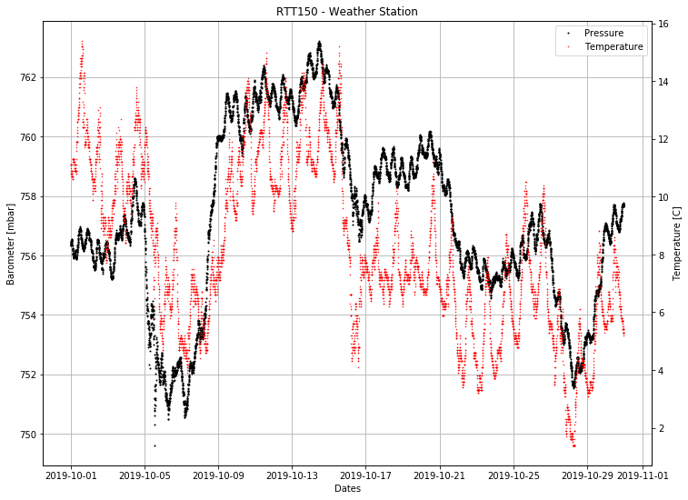

```python
%matplotlib inline
```

# ***tugmeteo***

### TÜBİTAK National Observatory (TUG) Meteorology Library

A library where instant and historical meteorological data can be obtained.

## Examples


```python
import warnings
import matplotlib.pyplot as plt

from tugmeteo import TugMeteo


warnings.filterwarnings("ignore")
```

#### Basic operations


```python
met = TugMeteo()
```


```python
met.get_last_meteo('RTT150')
```


    {'timestamp': '2019-11-13T03:49:38',
     'telescope': 'RTT150',
     'Temperature': 6.1,
     'Dome Temperature': 6.3,
     'Coude Temperature': 12.0,
     'Humidity': 58.0,
     'Dome Humidity': 54.0,
     'Coude Humidity': 51.5,
     'Barometer': 757.3,
     'Wind': 14.0,
     'Wind Chill': 3.2,
     'Dewpoint': -1.5,
     'High Temperature': 6.9,
     'Low Temperature': 6.1,
     'High Humidity': 60.0,
     'Low Humidity': 53.0,
     'High Barometer': 758.5,
     'Low Barometer': 757.2,
     'High Wind': 24.0,
     'Est. Cumulus Base': 956.0}


```python
met.get_temperature()
```


    {'timestamp': '2019-11-13T03:49:38',
     'info': 'Temperature',
     'unit': 'C',
     'RTT150': 6.1,
     'T100': 5.3,
     'T60': 6.0}


#### Getting meteo archive between '2019-10-01' and '2019-10-31' dates


```python
t = met.get_meteo_archives(telescope='RTT150', start_date='2019-10-01', end_date='2019-10-31')
```


```python
t
```


<div>
<table border="1" class="dataframe">
  <thead>
    <tr style="text-align: right;">
      <th></th>
      <th>Timestamp</th>
      <th>Temp</th>
      <th>Chill</th>
      <th>HIndex</th>
      <th>Humid</th>
      <th>Dewpt</th>
      <th>Wind</th>
      <th>HiWind</th>
      <th>WindDir</th>
      <th>Rain</th>
      <th>Barom</th>
      <th>Solar</th>
      <th>ET</th>
      <th>UV</th>
    </tr>
  </thead>
  <tbody>
    <tr>
      <th>0</th>
      <td>2019-10-01 00:05:00</td>
      <td>11.1</td>
      <td>11.1</td>
      <td>11.1</td>
      <td>63</td>
      <td>4.3</td>
      <td>10</td>
      <td>11</td>
      <td>45</td>
      <td>0.0</td>
      <td>756.318</td>
      <td>0</td>
      <td>0.0</td>
      <td>0</td>
    </tr>
    <tr>
      <th>1</th>
      <td>2019-10-01 00:10:00</td>
      <td>11.1</td>
      <td>11.1</td>
      <td>11.1</td>
      <td>63</td>
      <td>4.3</td>
      <td>10</td>
      <td>11</td>
      <td>45</td>
      <td>0.0</td>
      <td>756.352</td>
      <td>0</td>
      <td>0.0</td>
      <td>0</td>
    </tr>
    <tr>
      <th>2</th>
      <td>2019-10-01 00:15:00</td>
      <td>11.1</td>
      <td>11.1</td>
      <td>11.1</td>
      <td>63</td>
      <td>4.3</td>
      <td>8</td>
      <td>10</td>
      <td>67</td>
      <td>0.0</td>
      <td>756.352</td>
      <td>0</td>
      <td>0.0</td>
      <td>0</td>
    </tr>
    <tr>
      <th>3</th>
      <td>2019-10-01 00:20:00</td>
      <td>11.1</td>
      <td>11.1</td>
      <td>11.1</td>
      <td>64</td>
      <td>4.6</td>
      <td>6</td>
      <td>10</td>
      <td>67</td>
      <td>0.0</td>
      <td>756.318</td>
      <td>0</td>
      <td>0.0</td>
      <td>0</td>
    </tr>
    <tr>
      <th>4</th>
      <td>2019-10-01 00:25:00</td>
      <td>11.1</td>
      <td>11.1</td>
      <td>11.1</td>
      <td>64</td>
      <td>4.5</td>
      <td>2</td>
      <td>5</td>
      <td>67</td>
      <td>0.0</td>
      <td>756.386</td>
      <td>0</td>
      <td>0.0</td>
      <td>0</td>
    </tr>
    <tr>
      <th>...</th>
      <td>...</td>
      <td>...</td>
      <td>...</td>
      <td>...</td>
      <td>...</td>
      <td>...</td>
      <td>...</td>
      <td>...</td>
      <td>...</td>
      <td>...</td>
      <td>...</td>
      <td>...</td>
      <td>...</td>
      <td>...</td>
    </tr>
    <tr>
      <th>8605</th>
      <td>2019-10-30 23:35:00</td>
      <td>5.4</td>
      <td>4.1</td>
      <td>5.4</td>
      <td>76</td>
      <td>1.6</td>
      <td>6</td>
      <td>8</td>
      <td>112</td>
      <td>0.0</td>
      <td>757.707</td>
      <td>0</td>
      <td>0.0</td>
      <td>0</td>
    </tr>
    <tr>
      <th>8606</th>
      <td>2019-10-30 23:40:00</td>
      <td>5.4</td>
      <td>4.1</td>
      <td>5.4</td>
      <td>75</td>
      <td>1.4</td>
      <td>6</td>
      <td>10</td>
      <td>90</td>
      <td>0.0</td>
      <td>757.639</td>
      <td>0</td>
      <td>0.0</td>
      <td>0</td>
    </tr>
    <tr>
      <th>8607</th>
      <td>2019-10-30 23:45:00</td>
      <td>5.4</td>
      <td>4.1</td>
      <td>5.4</td>
      <td>75</td>
      <td>1.4</td>
      <td>6</td>
      <td>8</td>
      <td>112</td>
      <td>0.0</td>
      <td>757.639</td>
      <td>0</td>
      <td>0.0</td>
      <td>0</td>
    </tr>
    <tr>
      <th>8608</th>
      <td>2019-10-30 23:50:00</td>
      <td>5.5</td>
      <td>4.2</td>
      <td>5.5</td>
      <td>74</td>
      <td>1.2</td>
      <td>6</td>
      <td>10</td>
      <td>112</td>
      <td>0.0</td>
      <td>757.639</td>
      <td>0</td>
      <td>0.0</td>
      <td>0</td>
    </tr>
    <tr>
      <th>8609</th>
      <td>2019-10-30 23:55:00</td>
      <td>5.4</td>
      <td>4.1</td>
      <td>5.4</td>
      <td>74</td>
      <td>1.2</td>
      <td>6</td>
      <td>8</td>
      <td>90</td>
      <td>0.0</td>
      <td>757.639</td>
      <td>0</td>
      <td>0.0</td>
      <td>0</td>
    </tr>
  </tbody>
</table>
<p>8610 rows × 14 columns</p>
</div>


#### Plotting


```python
fig, ax = plt.subplots(figsize=(12, 9), dpi=72)

ax.grid()

ax.set_title('RTT150 - Weather Station')
ax.set_xlabel('Dates')
ax.set_ylabel('Barometer [mbar]')

press, = ax.plot(t.Timestamp, t.Barom, 'k.', ms=2)

ax1 = ax.twinx()

ax1.set_ylabel('Temperature [C]')
temp, = ax1.plot(t.Timestamp, t.Temp, 'r.', ms=1)

ax.legend(handles=[press, temp], labels=['Pressure', 'Temperature'], loc='upper right')
```


    <matplotlib.legend.Legend at 0x111441f90>





```python

```
